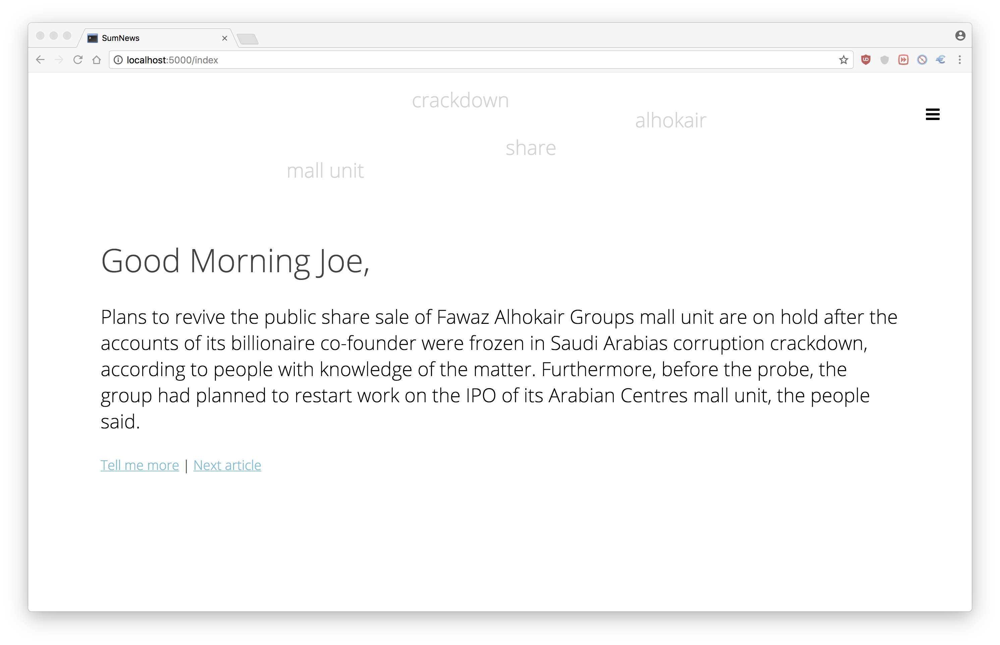
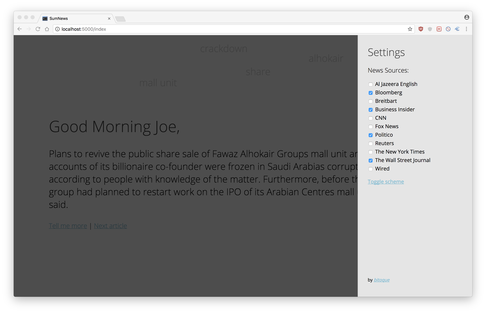
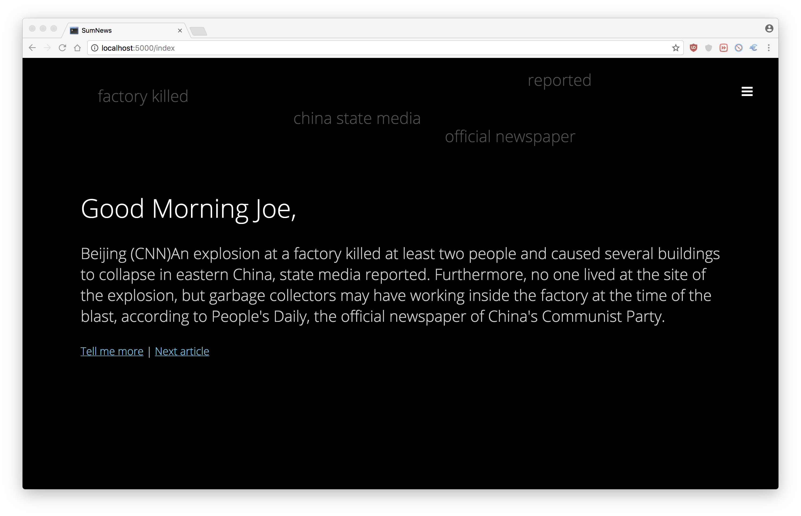

#SumNews
Minimalistic news displayer and summarizer created as part of the news summarization challange by Nordcloud at [Junction 2017](https://hackjunction.com/). 

Dark color scheme

##Goal
The goal of this web app is to offer users summarized information from a range of different news sources, allowing users to explore different biases.

##Design
We wanted to engage users through design and a smooth UX. By having a minimalistic, Nordic UI we wanted to focus users' attention on the information in front of them. We tried to develop a personal edge with the user, by employing welcoming and neutral color schemes.

##Algorithm
For our final algorithm we used the gensim modelling library to summarize the news articles we fetched. After exploring other avenues for text summarization we decided that, given time and solution constraints, it would be best to use a pre-trained module. However, we optimized how we integrated this library in our solution to allow for as brief and fluid summaries as possible - facilitating the users' grasp of the article.

## Implementation
The implementation was done in Python 2.7 using Flask for the backend. It also makes use of the following APIs:

- [gensim](https://radimrehurek.com/gensim/index.html) Python API (`pip install gensim`)
- [News API](http://newsapi.org)
- [Diffbot Automatic APIs](https://www.diffbot.com/products/automatic)

and the [font awesome](http://fontawesome.io/) CSS kit.

It uses [jQuery 2.2.4](https://code.jquery.com/) and the `Open Sans` font from [Google Fonts](https://fonts.google.com). The respective API keys have been removed and replaced by placeholders.

## Screenshots

Settings menu

Dark color scheme

##Team
- [Lilja Listus](https://github.com/lilja-listus)
- Francisco Eiras
- [Sebastian Tranaeus](https://github.com/sTranaeus)
- [Vladimir Visbek](https://github.com/vviisbek)

## 
###### Last edit: 27 Nov 2017 by fgirbal